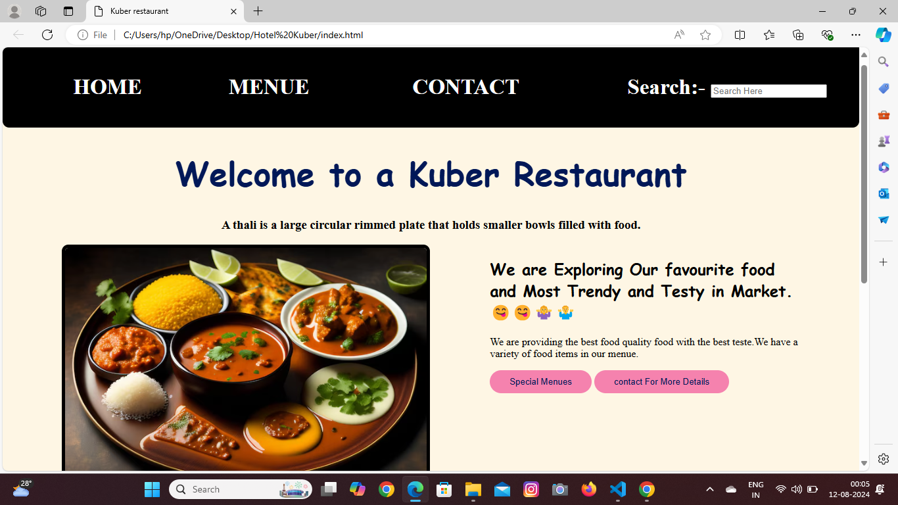

# Kuber Restaurant✌️🤷‍♂️

Welcome to a kuber Restaurant in Rahuri!
A restaurant is a place where you can eat a meal and pay for it. In restaurants, your food is usually served to you at your table by a waiter or waitress. The restaurant serves breakfast, lunch, and dinner. The food at the restaurant was good and the waiters were polite.
 
 ### We have Follow various pages in this websites:-

- Home
- Menue
- Contact
  
 ## Home Page:-

# Information About Menue Page 
 - Summery Of  Menue page: This is an menu  Page.This page content information about different diffrent Thalis in market or Our Restaurant of Kuber in Rahuri.
- what Language I have Used : HTML 5 and css.
  
  # Menue Page
  

  ## Basic Information About Menus 
  - The Quality of Thali where Best in All over Rahuri and pune.
  - We provide You Best price 
  
  # Contact Page
    

    # Information About Contact Page
    - Summery of Contact page:This page content helping for our customer and they contact us very fastly
    -  Language where use:HTML 5 and css.
  ## More Information About Contact Page:-
  1. Hours of operation: This tells customers when they can contact your business.
1. Phone number and email address: Customers can contact your business directly.
2. Response time: Let customers know when they should expect a response.
3. Location: Build trust with customers by showing you're legitimate.
